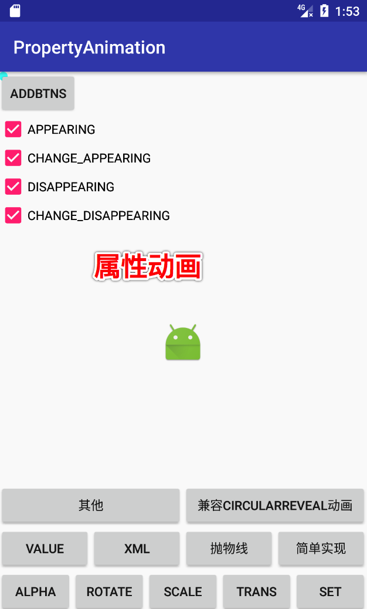

# 属性动画

## ObjectAnimator 生成属性动画

### 模仿水波纹动画

    ObjectAnimator revealAnimator = ObjectAnimator.ofFloat( //缩放X 轴的
            mLl, "scaleX", 0, 200);
    ObjectAnimator revealAnimator1 = ObjectAnimator.ofFloat(//缩放Y 轴的
            mLl, "scaleY", 0, 200);
    AnimatorSet set = new AnimatorSet();
    set.setDuration(500);//设置播放时间
    set.setInterpolator(new LinearInterpolator());//设置播放模式，这里是平常模式
    set.playTogether(revealAnimator, revealAnimator1);//设置一起播放
    set.start();

### PathInterpolator动画插入器

        // 路径 path
        Path path = new Path();
        // 移动到 坐标 (100,100)
        path.moveTo(100,100);
        // 四方 x1,y1,x2,y2
        // x轴: 100 -> 1000 -> 300
        // y轴: 100 -> 300  -> 0
        path.quadTo(1000,300,300,0);
        ObjectAnimator mAnimator = ObjectAnimator.ofFloat(iv, View.X, View.Y, path);

        // 路径插入起
        Path p = new Path();
        // 必须从 (0.0) -> (1,1)
        p.lineTo(0.6f, 0.9f);
        p.lineTo(0.75f, 0.2f);
        p.lineTo(1f, 1f);
        mAnimator.setInterpolator(new PathInterpolator(p));
        mAnimator.setDuration(3000);
        mAnimator.start();

### alpha 透明度动画

        ObjectAnimator oa = ObjectAnimator.ofFloat(iv,
                "alpha", 0.0f, 0.2f, 0.4f, 0.6f, 0.8f, 1.0f);
        oa.setDuration(4000);
        oa.setRepeatMode(ObjectAnimator.REVERSE);
        oa.setRepeatCount(ObjectAnimator.INFINITE);
        oa.start();

### rotate 旋转动画

        ObjectAnimator oa = ObjectAnimator.ofFloat(iv, "rotationX", 
                0.0f, 30f, 60.0f, 90f);
        oa.setDuration(2000);
        oa.setRepeatMode(ObjectAnimator.REVERSE);
        oa.setRepeatCount(ObjectAnimator.INFINITE);
        oa.start();

### scale 缩放动画

        // scaleY  Y轴缩放动画
        ObjectAnimator oa = ObjectAnimator.ofFloat(iv, "scaleY", 0.0f, 0.2f, 0.5f, 2.0f);
        oa.setDuration(2000);
        oa.setRepeatMode(ObjectAnimator.REVERSE);
        oa.setRepeatCount(ObjectAnimator.INFINITE);
        oa.start();

### translation 位移动画

        // translationX X轴位移动画
        ObjectAnimator oa = ObjectAnimator.ofFloat(iv, "translationX", 0.0f, 30f, 60f, 200f);
        oa.setDuration(2000);
        oa.setRepeatMode(ObjectAnimator.REVERSE);
        oa.setRepeatCount(2);
        oa.start();

### 属性动画动画监听器

        objectAnimator.addListener(new Animator.AnimatorListener() {
            @Override
            public void onAnimationStart(Animator animation) {
            }
            @Override
            public void onAnimationEnd(Animator animation) {
                ViewGroup parent = (ViewGroup) iv.getParent();
                if (parent != null) {
                    parent.removeView(iv);
                }
            }

            @Override
            public void onAnimationCancel(Animator animation) {
            }

            @Override
            public void onAnimationRepeat(Animator animation) {
            }
        });        

### 属性动画集合

#### PropertyValuesHolder 方式创建动画集合

        PropertyValuesHolder pvhX = PropertyValuesHolder
                .ofFloat("alpha", 1f, 0f, 1f);
        PropertyValuesHolder pvhY = PropertyValuesHolder
                .ofFloat("scaleX", 1f, 0, 1f);
        PropertyValuesHolder pvhZ = PropertyValuesHolder
                .ofFloat("scaleY", 1f, 0, 1f);
        ObjectAnimator
                .ofPropertyValuesHolder(iv, pvhX, pvhY, pvhZ)
                .setDuration(3000)
                .start();

#### AnimatorSet 方式创建动画集合

        AnimatorSet set = new AnimatorSet();
        ObjectAnimator oa = ObjectAnimator
            .ofFloat(iv, "rotation", 0.0f, 30f, 60.0f, 90f);
        oa.setDuration(4000);
        ObjectAnimator oa2 = ObjectAnimator
            .ofFloat(iv, "translationX", 0.0f, 10f, 20, 40f, 60f, 100f, 200f, 600f);
        oa2.setDuration(2000);
        //有序
        set.playSequentially(oa, oa2);
        //一起
        //set.playTogether(oa,oa2);
        
       /*
        让
            scaleYAnimator、
            scaleXAnimator、
            rotationXAnimator
        同时执行执行完之后执行alphaAnimator
        set.play(scaleXAnimator).with(scaleYAnimator);
        set.play(scaleYAnimator).with(rotationXAnimator);
        set.play(alphaAnimator).after(rotationXAnimator);
        */
        set.start();

## ValueAnimator 生成属性动画

        ValueAnimator valueAnimator = ValueAnimator.ofFloat(0, 600);
        valueAnimator.setDuration(3000);
        valueAnimator.addUpdateListener(new ValueAnimator.AnimatorUpdateListener() {
            @Override
            public void onAnimationUpdate(ValueAnimator animation) {
                float value = (Float) animation.getAnimatedValue();

                iv.setTranslationX(value);
                iv.setTranslationY(value);
            }
        });
        valueAnimator.start();

## xml 生成属性动画

      java
      
        Animator animator = AnimatorInflater.loadAnimator(MainActivity.this,
                R.animator.animator_set);
        animator.setTarget(iv);
        animator.start();     

      xml
      
        <?xml version="1.0" encoding="utf-8"?>
        <set xmlns:android="http://schemas.android.com/apk/res/android"
             android:ordering="sequentially" >
            <!--
            <animator> 对应代码中的 ValueAnimator
            <objectAnimator> 对应代码中的 ObjectAnimator
            -->
        
            <objectAnimator
                android:duration="2000"
                android:propertyName="translationX"
                android:valueFrom="-500"
                android:valueTo="0"
                android:valueType="floatType" >
            </objectAnimator>
        
            <set android:ordering="sequentially" >
                <objectAnimator
                    android:duration="3000"
                    android:propertyName="rotation"
                    android:valueFrom="0"
                    android:valueTo="360"
                    android:valueType="floatType" >
                </objectAnimator>
        
                <set android:ordering="together" >
                    <objectAnimator
                        android:duration="2000"
                        android:propertyName="alpha"
                        android:valueFrom="1"
                        android:valueTo="0.5"
                        android:valueType="floatType" >
                    </objectAnimator>
                    <objectAnimator
                        android:duration="2000"
                        android:propertyName="translationX"
                        android:valueFrom="0"
                        android:valueTo="200"
                        android:valueType="floatType" >
                    </objectAnimator>
                </set>
            </set>
        
        </set>

## 组件 自身可实现的属性动画

        // need API12
        iv.animate()
                .alpha(0)
                .y(mScreenHeight / 2)
                .setDuration(1000)
                // need API 12
                .withStartAction(new Runnable() {
                    @Override
                    public void run() {
                        // 主线程
                    }
                    // need API 16
                })
                .withEndAction(new Runnable() {
                    @Override
                    public void run() {
                        // 主线程
                        iv.setY(0);
                        iv.setAlpha(1.0f);
                    }
                }).start();    

## 自定义估值器，实现抛物线

    ValueAnimator valueAnimator = new ValueAnimator();
        // 执行时间
        valueAnimator.setDuration(3000);
        // (0,0) 起始点
        valueAnimator.setObjectValues(new PointF(0, 0));
        // 线性插值器
        valueAnimator.setInterpolator(new LinearInterpolator());
        // 自定义估值器
        valueAnimator.setEvaluator(new TypeEvaluator<PointF>() {
            // fraction = t / duration
            @Override
            public PointF evaluate(float fraction, PointF startValue,
                                   PointF endValue) {
                // x方向200px/s ，则y方向0.5 * 10 * t
                PointF point = new PointF();
                point.x = 200 * fraction * 3;
                point.y = 0.5f * 200 * (fraction * 3) * (fraction * 3);
                return point;
            }
        });
        valueAnimator.start();
        valueAnimator.addUpdateListener(new ValueAnimator.AnimatorUpdateListener() {
            @Override
            public void onAnimationUpdate(ValueAnimator animation) {
                PointF point = (PointF) animation.getAnimatedValue();
                iv.setX(point.x);
                iv.setY(point.y);
            }
        });

## 容器中组件被 添加|删除 的动画

        // 创建一个GridLayout
        mGridLayout = new GridLayout(this);
        // 设置每列5个按钮
        mGridLayout.setColumnCount(5);
        // 添加到根布局中
        viewGroup.addView(mGridLayout);
        //默认动画全部开启
        mGridLayout.setLayoutTransition(new LayoutTransition());        
  
        // 设置自定义动画
        mTransition = new LayoutTransition();
        mTransition.setAnimator(
                //当一个View在ViewGroup中出现时，对此View设置的动画
                LayoutTransition.APPEARING,
                (mAppear.isChecked() ?
                        //自定义动画
                        //ObjectAnimator.ofFloat(this, "scaleX", 0, 1)
                        mTransition.getAnimator(LayoutTransition.APPEARING)
                        : null));
        mTransition.setAnimator(
                //当一个View在ViewGroup中出现时，对此View对其他View位置造成影响，对其他View设置的动画
                LayoutTransition.CHANGE_APPEARING,
                (mChangeAppear.isChecked() ? 
                        mTransition.getAnimator(LayoutTransition.CHANGE_APPEARING) 
                        : null));
        mTransition.setAnimator(
                //当一个View在ViewGroup中消失时，对此View设置的动画
                LayoutTransition.DISAPPEARING,
                (mDisAppear.isChecked() ? 
                        mTransition.getAnimator(LayoutTransition.DISAPPEARING) 
                        : null));
        mTransition.setAnimator(
                //当一个View在ViewGroup中消失时，对此View对其他View位置造成影响，对其他View设置的动画
                LayoutTransition.CHANGE_DISAPPEARING,
                (mChangeDisAppear.isChecked() ? 
                        mTransition.getAnimator(LayoutTransition.CHANGE_DISAPPEARING) 
                        : null));
        // 为容器设置动画 此处容器 是GridLayout
        mGridLayout.setLayoutTransition(mTransition);