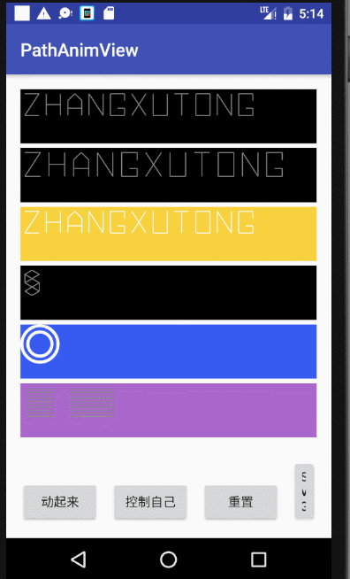
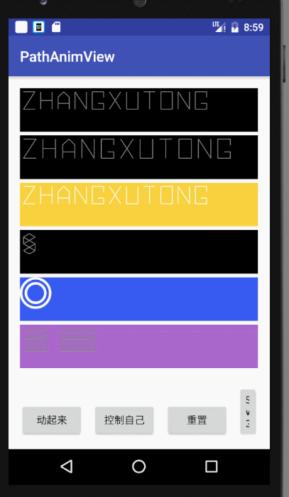
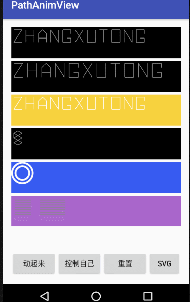
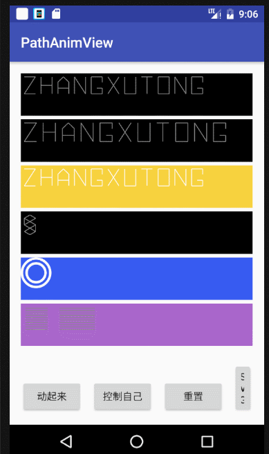

# SVG

## SVG 的简单实现

    xml
    <ImageView
            android:layout_width="wrap_content"
            android:layout_height="wrap_content"
            android:src="@drawable/ic_android_black_24dp"/>
           
    drawable
    <!--
    
    vector 标签
    android:width和android:height属性，
        这两个属性是必填的，定义矢量图形的绝对大小，
        虽然说是矢量图形随意缩放，
        但是不能说这里不定义 宽高 直接到要设置到的目标控件上定义控件的宽高，
        这样是不允许的，一定要设置这个绝对宽高，要不然会报错。
    
    android:viewportHeight和android:viewportWidth属性，
        这个是画布 宽高，也是必填的，
        定义 Path路径 的时候就必须在这个画布大小里去绘制，
        超出画布就显示不出来了。
    
    path标签
    android:fillColor属性定义绘制颜色，
    android:pathData定义绘制路径。
    
    -->
    
    <vector xmlns:android="http://schemas.android.com/apk/res/android"
            android:width="300dp"
            android:height="300dp"
            android:viewportHeight="24.0"
            android:viewportWidth="24.0">
        <path
            android:fillColor="#FF000000"
            android:pathData="M6,18c0,0.55 0.45,1 1,1h1v3.5c0,0.83 0.67,1.5 1.5,1.5s1.5,-0.67 1.5,-1.5L11,19h2v3.5c0,0.83 0.67,1.5 1.5,1.5s1.5,-0.67 1.5,-1.5L16,19h1c0.55,0 1,-0.45 1,-1L18,8L6,8v10zM3.5,8C2.67,8 2,8.67 2,9.5v7c0,0.83 0.67,1.5 1.5,1.5S5,17.33 5,16.5v-7C5,8.67 4.33,8 3.5,8zM20.5,8c-0.83,0 -1.5,0.67 -1.5,1.5v7c0,0.83 0.67,1.5 1.5,1.5s1.5,-0.67 1.5,-1.5v-7c0,-0.83 -0.67,-1.5 -1.5,-1.5zM15.53,2.16l1.3,-1.3c0.2,-0.2 0.2,-0.51 0,-0.71 -0.2,-0.2 -0.51,-0.2 -0.71,0l-1.48,1.48C13.85,1.23 12.95,1 12,1c-0.96,0 -1.86,0.23 -2.66,0.63L7.85,0.15c-0.2,-0.2 -0.51,-0.2 -0.71,0 -0.2,0.2 -0.2,0.51 0,0.71l1.31,1.31C6.97,3.26 6,5.01 6,7h12c0,-1.99 -0.97,-3.75 -2.47,-4.84zM10,5L9,5L9,4h1v1zM15,5h-1L14,4h1v1z"/>
    </vector>

## Path动画 与 SVG路径 zhon综合使用

