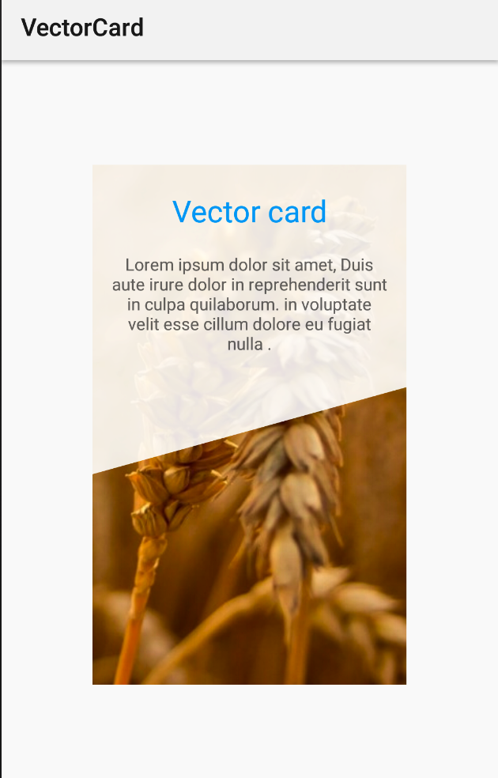
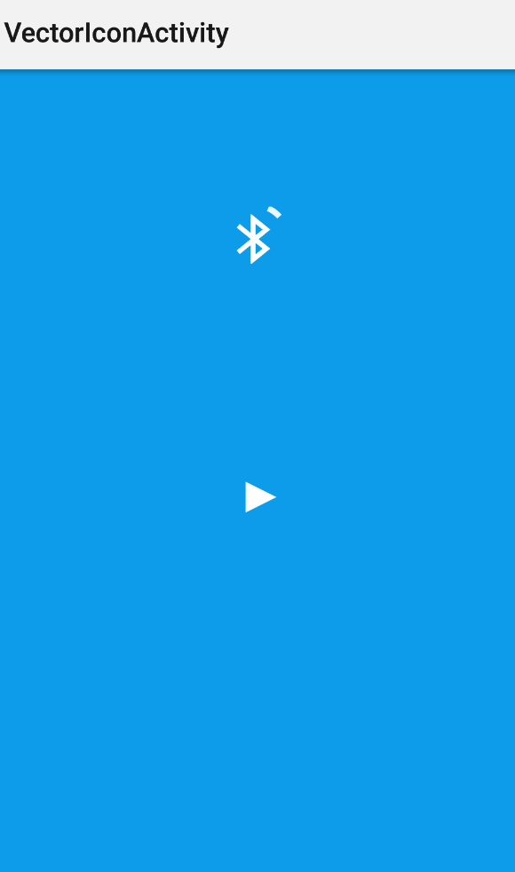

# SVG 应用

## SVG 动画

        SVG动画尺寸过大这种方法不是Android SVG推荐的用法,SVG动画尺寸应该尽可能的小,

        原因：因为每次动画都会先把这些path先计算绘成Bitmap,

        然后上传texture到GPU,如果SVG太大意味着生成更大的Bitmap,
        
        占更多内存,消耗更多时间.
        
        Google的推荐是把SVG用于图标(icon)和按钮(Button),
        
        只有需要的时候才修改Vector的属性(比如alpha,width,height),
        
        因为如果SVG不用于动画,android会把这个图生成一个Cache来节省时间,
        
        如果使用SVG动画这个Cache就没有用了。
        
        如果要用SVG动画，请确保它“短小精悍”（Short and sweet）。    

## 使用xml 配置属性动画 修改 SVG 的路径

## SVG 组件应用

